<div align="center">
  
</div>

<h1 align="center">
  
</h1>

<div align="center">
  <a href="https://subhradev.netlify.app" target="_blank">
    
  </a>
  <a href="https://www.linkedin.com/in/subhra-sundar-sinha-779538181" target="_blank">
    
  </a>
  <a href="mailto:subhrasundarsinha21@gmail.com">
    
  </a>
</div>

<br/>

<div align="center">
  
</div>


##  About Me

```javascript
const subhra = {
    location: "Siliguri, India 🇮🇳",
    role: "Full Stack Developer",
    techStack: ["MERN", "JavaScript", "React", "Node.js"],
    passions: ["Coding", "Graphic Design", "Problem Solving"],
    currentFocus: "Building scalable applications & AI-powered tools",
    funFact: "I prefer tabs over spaces ⚡",
    motto: "Code, Create, Innovate 🚀"
};
```


##  Tech Arsenal

<div align="center">

### 🎨 Frontend Technologies


### ⚙️ Backend Technologies  


### 🛠️ Tools & DevOps


</div>


##  GitHub Analytics

<div align="center">
  
  
</div>

<div align="center">
  
</div>

<div align="center">
  
</div>


##  Featured Projects

<div align="center">

| 🍕 **Restaurant Management App** | 🛒 **Ecommerce Site** | 🧩 **Chrome Extensions** |
|:---:|:---:|:---:|
| A comprehensive web-based Restaurant Management System designed with the powerful MERN stack |Full-stack MERN application with payment integration and real-time tracking with robust user authentication | Productivity-focused browser extensions |
| `React` `Node.js` `MongoDB` `Express` `AntDesign` `REST Api`| `Express` `JWT` `bcrypt` `Multer` | `JavaScript` `Chrome APIs` `Manifest V3` |

```mermaid
graph LR
    A[🔧 GitHub Profilinator] --> B[Visual Profile Enhancement]
    C[🤖 AI Applications] --> D[Productivity Tools]
    E[🌐 Open Source] --> F[Community Contributions]
    G[📚 DSA Practice] --> H[Problem Solving]
```

</div>


##  Currently Working On

<div align="center">



</div>

- 🚀 **GitHub Profilinator** - Enhancing visual coding profiles
- 🤖 **AI-powered Applications** - Building intelligent productivity tools  
- 🌟 **Open Source Contributions** - Contributing to community projects
- 🧠 **Data Structures & Algorithms** - Daily problem solving practice


##  Let's Connect

<div align="center">
  <a href="https://subhradev.netlify.app" target="_blank">
    
  </a>
  <a href="https://www.linkedin.com/in/subhra-sundar-sinha-779538181" target="_blank">
    
  </a>
  <a href="mailto:subhrasundarsinha21@gmail.com">
    
  </a>
  <a href="https://github.com/PavilionRYZ" target="_blank">
    
  </a>
</div>

<br/>

<div align="center">
  
  
</div>

<div align="center">
  
</div>

---

<div align="center">
  <h3>💫 "Code is like humor. When you have to explain it, it's bad." - Cory House</h3>
</div>
